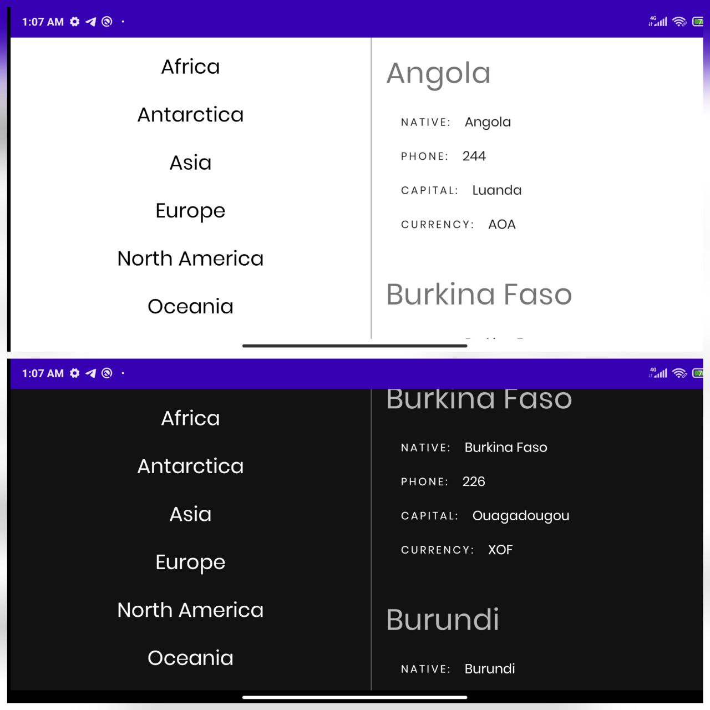
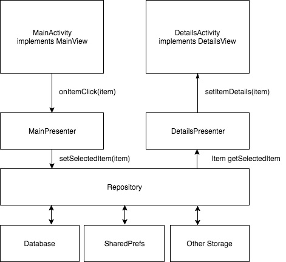

# Graph/Mvp/Moxy
#### Sample project showing use of remote db querying with GraphQl, Moxy / MVP,Clean Architecture.

###### App contains of one screen divided into two fragments. The architecture design is pretty clean, providers can talk to each other without knowing each other, it is done through observer pattern

